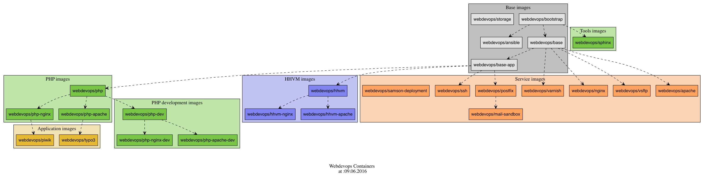

Automated built and tested on [WebDevOps Build server](https://build.webdevops.io/) sponsored by 

# Documentation

* [Documentation is available on readthedocs](https://dockerfile.readthedocs.io/en/latest/)

Dockerfile                                                | Description                                                                             | Depends on                                                                       |
--------------------------------------------------------- | --------------------------------------------------------------------------------------- | -------------------------------------------------------------------------------- |
[`bootstrap`](docker/base/README.md)                      | Distribution with ansible and some scripts                                              | official docker files                                                            |
[`base`](docker/base/README.md)                           | Base containers for WebDevOps service containers                                        | [`webdevops/bootstrap`](https://hub.docker.com/r/webdevops/bootstrap/)           |
[`base-app`](docker/base-app/README.md)                   | Base containers for WebDevOps application containers                                    | [`webdevops/base`](https://hub.docker.com/r/webdevops/base/)                     |
[`php`](docker/php/README.md)                             | PHP (cli and fpm) service containers                                                    | [`webdevops/base-app`](https://hub.docker.com/r/webdevops/base-app/)             |
[`php-apache`](docker/php-apache/README.md)               | PHP (cli and fpm) with Apache service containers                                        | [`webdevops/php`](https://hub.docker.com/r/webdevops/php/)                       |
[`php-nginx`](docker/php-nginx/README.md)                 | PHP (cli and fpm) with Nginx service containers                                         | [`webdevops/php`](https://hub.docker.com/r/webdevops/php/)                       |
[`hhvm`](docker/hhvm/README.md)                           | HHVM (cli and fcgi) service containers                                                  | [`webdevops/base-app`](https://hub.docker.com/r/webdevops/base-app/)             |
[`hhvm-apache`](docker/hhvm-apache/README.md)             | HHVM (cli and fcgi) with Apache service containers                                      | [`webdevops/hhvm`](https://hub.docker.com/r/webdevops/hhvm/)                     |
[`hhvm-nginx`](docker/hhvm-nginx/README.md)               | HHVM (cli and fcgi) with Nginx service containers                                       | [`webdevops/hhvm`](https://hub.docker.com/r/webdevops/hhvm/)                     |
[`vsftp`](docker/vsftp/README.md)                         | VSFTP (ftp service) service container                                                   | [`webdevops/base:latest`](https://hub.docker.com/r/webdevops/base/)              |
[`storage`](docker/storage/latest/README.md)              | Storage (noop) container                                                                | [`webdevops/base:latest`](https://hub.docker.com/r/webdevops/base/)              |
[`ssh`](docker/ssh/README.md)                             | SSH service container                                                                   | [`webdevops/base:latest`](https://hub.docker.com/r/webdevops/base/)              |
[`postfix`](docker/postfix/README.md)                     | Postfix service container                                                               | [`webdevops/base:latest`](https://hub.docker.com/r/webdevops/base/)              |
[`mail-sandbox`](docker/mail-sandbox/README.md)           | Mail catcher service container (catches all mails via SMTP and are accessable via IMAP) | [`webdevops/postfix:latest`](https://hub.docker.com/r/webdevops/postfix/)        |
[`samson-deployment`](docker/samson-deployment/README.md) | [Samson](https://github.com/webdevops/samson-deployment) based deployment service       | [`zendesk/samson`](https://hub.docker.com/r/zendesk/samson/)                     |
[`sphinx`](docker/sphinx/latest/README.md)                | Sphinx container                                                                        | [`webdevops/bootstrap:alpine-3`](https://hub.docker.com/r/webdevops/bootstrap/)  |
[`varnish`](docker/varnish/latest/README.md)              | Varnish container                                                                       | [`webdevops/base:alpine-3`](https://hub.docker.com/r/webdevops/bootstrap/)       |

# Building

Local building of containers can be done with `make` and `Makefile`:

Command                     | Description                                                                       
--------------------------- | ----------------------------------------------------------------------------------
`sudo make setup`           | To Install dependancies of build chain tools 
`make all`                  | Build all containers *fast mode* (parallel building, `FAST=1`)
`FAST=0 make all`           | Build all containers *slow mode* (serial building)
`DEBUG=1 make all`          | Show log of build process even if process is successfull
`FORCE=1 make all`          | Force container build (`docker build --no-cache ...`)
`WHITELIST="alpine-3 centos-7" make all`          | Build all container with tag alpine-3 or centos-7
                         |
`make baselayout`           | Build and deploy baselayout.tar
`make provision`            | Deploy all configuration files from [_provisioning/](_provisioning/README.md)
`make dist-update`          | Update local distrubtion images (CentOS, Debian, Ubuntu)
`make full`                 | Run provision and build all images
                         |
`make test`                 | Run testsuite (use currently available docker images on your docker host)
`make test-hub-images`      | Run testsuite but pull newest docker images from docker hub first
                         |
`make push`                 | Run tests and rebuild them (use cache) and push them to docker hub
`make publish`              | Run `dist-update`, `all` with FORCE and `push`
                         |
`make base`                 | Build all base containers
`make service`              | Build all service containers
`make php`                  | Build all php containers
`make hhvm`                 | Build all hhvm containers
`make nginx`                | Build all nginx containers
`make apache`               | Build all apache containers
`make webdevops/php-nginx`  | Build specific containers (as example)

# Provisioning

All `base` inherited containers provides an modular provisioning available as simple shell scripts and ansible roles.
See [docker/base/README.md](docker/base/README.md) for more informations.

The configuration and provisioning files are build from [_provisioning/](_provisioning/README.md) to get a consistent
configuraiton for all containers. This also should reduce copy&paste errors because the configuration will be deployed
automatically into containers on build process.

